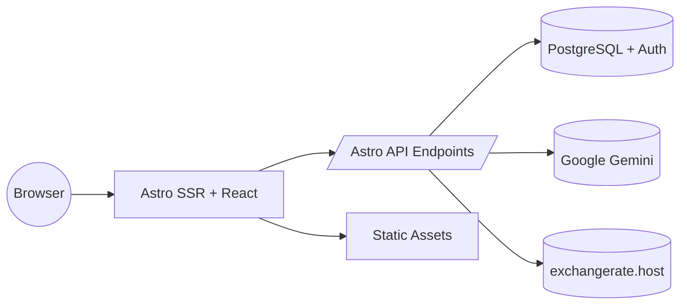

# Contributing to TripCrafti

Thank you for your interest in contributing to **TripCrafti**! This guide explains how to set up the project, coding style, commit conventions, and the Pull Request process.

## Table of Contents
1. [Quick Start](#quick-start)
2. [Architecture Overview](#architecture-overview)
3. [Environment / .env](#environment--env)
4. [Branch Naming](#branch-naming)
5. [Commit Conventions](#commit-conventions)
6. [Code Style](#code-style)
7. [Testing](#testing)
8. [I18n / Localization](#i18n--localization)
9. [AI (Itinerary & Packing)](#ai-itinerary--packing)
10. [PR Checklist](#pr-checklist)
11. [Security / Secrets](#security--secrets)
12. [Communication](#communication)

---
## Quick Start
```bash
# 1. Fork + clone
# 2. Install dependencies
npm install
# 3. Copy example env
cp .env.example .env   # Windows: copy .env.example .env
# 4. Start dev
npm run dev
# 5. Tests
npm test
```
> Ensure **Node 20+** and a **Supabase** project (URL + anon key).

## Architecture Overview
Monorepo **Astro** (SSR + React islands) + **Supabase** (Auth + Postgres) + AI (Gemini). Business logic lives in `src/pages/api/**` endpoints.

Mermaid (high level):


## Environment / .env
Key variables (see README for details):
```
PUBLIC_SUPABASE_URL=
PUBLIC_SUPABASE_ANON_KEY=
GEMINI_API_KEY=
# GEMINI_MODEL=gemini-2.5-flash
# PUBLIC_FX_API_BASE=https://api.exchangerate.host
# EXCHANGERATE_API_KEY=...
# UNSPLASH_ACCESS_KEY=...
```
Rule: **secrets never use `PUBLIC_`**.

## Branch Naming
Pattern: `type/short-description`:
* `feat/ai-packing-regenerate`
* `fix/fx-fallback-warning`
* `chore/deps-update`
* `docs/readme-i18n`

Core types: `feat`, `fix`, `refactor`, `perf`, `docs`, `test`, `chore`, `build`, `ci`.

## Commit Conventions
We use **Conventional Commits**:
```
<type>(optional scope): <imperative short description>

[optional body]
[optional BREAKING CHANGE: description]
```
Types: `feat`, `fix`, `docs`, `style`, `refactor`, `perf`, `test`, `build`, `ci`, `chore`.
Examples:
```
feat(packing): limit 2 AI list regenerations
fix(fx): improve fallback on HTTP 500
refactor(itinerary): simplify JSON parser
docs(readme): add env section
```

## Code Style
* **Strict TypeScript** – add shared interface types to `src/types.ts`.
* **Early returns** over nested ifs.
* **Keep heavy logic out of components** – extract to hooks (`src/components/hooks`) or services (`src/lib/services`).
* **Env access** via `import.meta.env` + types in `env.d.ts`.
* **File naming**: `camelCase.ts` for utils, `PascalCase.tsx` for components.
* **CSS**: Tailwind – avoid custom classes when a utility exists (group by semantics: layout / color / typography / interaction).
* **AI prompts** stored in `src/lib/prompts/` (JSON contracts; no markdown fences).
* ESLint rule `no-hardcoded-jsx-text`: move user-facing text into dictionaries (pl/en).

## Testing
* Run: `npm test` (Vitest).
* Categories:
  - **unit**: FX logic, utils, budget
  - **component**: React components (Testing Library)
  - **parsing**: Gemini JSON heuristics
* Provide at least: happy path + edge (provider error / empty list).
* Mock `fetch` for FX & AI tests.

## I18n / Localization
* New language: extend `Lang` + add dictionary entry (mirror structure).
* Do not duplicate keys; group by domain (budget, packing, itinerary).
* Use placeholders (`{title}`, `{count}`) not string concatenation.

## AI (Itinerary & Packing)
* **Itinerary**: fallback model list (override with `GEMINI_MODEL`). Output = single valid JSON (days + activities).
* **Packing**: pipeline = generate → (0–2) regenerate (diff) → validate (suggestions) → categorize → manual edits → share.
* Validate JSON integrity – fallback / parsing heuristics covered by tests.
* Validation suggestion kinds: missing / remove / adjust / replace.

## PR Checklist
Before submitting a PR:
- [ ] Updated README / docs (if public change)
- [ ] Added / updated tests
- [ ] ESLint clean (`npm run lint`)
- [ ] Build passes (`npm run build`)
- [ ] No stray console.log / temp comments
- [ ] New env vars documented if added
- [ ] i18n keys added for PL and EN

## Security / Secrets
* Never commit `.env`.
* Secrets only in local env / CI (no PUBLIC_ unless intentionally exposed).
* Packing share tokens treated as sensitive – enforce permission checks.
* Validate input with Zod (add schemas for new endpoints).

## Communication
* For large changes: open a draft PR with rationale.
* Architectural decisions: add an ADR in `docs/decisions/<yyyy-mm-dd>-name.md` (lightweight format).

Happy contributing! 💙
