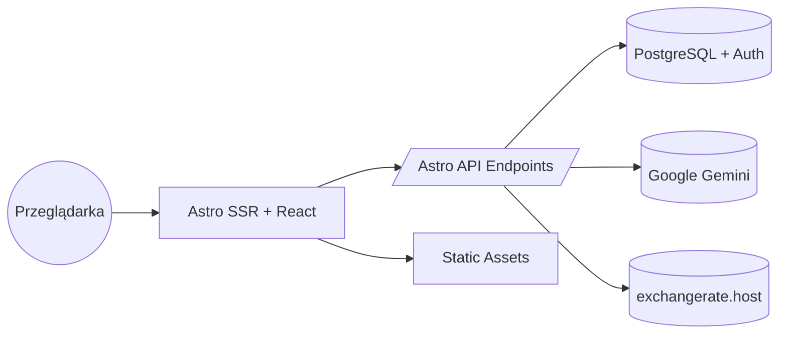

# Contributing to TripCrafti

Dziękujemy za zainteresowanie współtworzeniem **TripCrafti**! Ten dokument opisuje jak rozpocząć pracę, styl kodu, konwencje commitów oraz proces Pull Request.

## Spis treści
1. [Szybki Start](#szybki-start)
2. [Architektura w skrócie](#architektura-w-skrócie)
3. [Środowisko / .env](#środowisko--env)
4. [Konwencje Branchy](#konwencje-branchy)
5. [Konwencje Commitów](#konwencje-commitów)
6. [Styl Kodowania](#styl-kodowania)
7. [Testowanie](#testowanie)
8. [I18n / Lokalizacja](#i18n--lokalizacja)
9. [AI (Itinerary & Packing)](#ai-itinerary--packing)
10. [Checklist PR](#checklist-pr)
11. [Security / Secrets](#security--secrets)
12. [Komunikacja](#komunikacja)

---
## Szybki Start
```bash
# 1. Fork + clone
# 2. Install dependencies
npm install
# 3. Skopiuj przykład env
cp .env.example .env  # Windows: copy .env.example .env
# 4. Uruchom dev
npm run dev
# 5. Testy
npm test
```
> Upewnij się, że masz **Node 18+** i konto **Supabase**.

## Architektura w skrócie
Monorepo **Astro** (SSR + React wyspy) + **Supabase** (Auth + Postgres) + AI (Gemini). Biznesowa logika w endpointach `src/pages/api/**`.

Mermaid (wysoki poziom):


## Środowisko / .env
Kluczowe zmienne (szczegóły w README):
```
PUBLIC_SUPABASE_URL=
PUBLIC_SUPABASE_ANON_KEY=
GEMINI_API_KEY=
# GEMINI_MODEL=gemini-2.5-flash
# PUBLIC_FX_API_BASE=https://api.exchangerate.host
# EXCHANGERATE_API_KEY=...
# UNSPLASH_ACCESS_KEY=...
```
Zasada: **sekrety bez `PUBLIC_`**.

## Konwencje Branchy
Format: `typ/krótki-opis`:
* `feat/ai-packing-regenerate`
* `fix/fx-fallback-warning`
* `chore/deps-update`
* `docs/readme-i18n`

Główne typy: `feat`, `fix`, `refactor`, `perf`, `docs`, `test`, `chore`, `build`, `ci`.

## Konwencje Commitów
Używamy **Conventional Commits**:
```
<type>(opcjonalny scope): <krótki opis w trybie rozkazującym>

[opcjonalne body]
[opcjonalne BREAKING CHANGE: opis]
```
Typy: `feat`, `fix`, `docs`, `style`, `refactor`, `perf`, `test`, `build`, `ci`, `chore`. 
Przykłady:
```
feat(packing): limit 2 regeneracje listy AI
fix(fx): popraw fallback przy HTTP 500
refactor(itinerary): uproszczony parser JSON
docs(readme): dodano sekcję env
```

## Styl Kodowania
* **TypeScript strict** – dodawaj typy interfejsów w `src/types.ts` jeśli są dzielone.
* **Early returns** zamiast zagnieżdżonych if.
* **Brak logiki w komponentach ciężkiej** – ekstrakcja do hooków w `src/components/hooks` lub usług w `src/lib/services`.
* **Env dostęp** tylko przez `import.meta.env` + typy w `env.d.ts`.
* **Nazewnictwo plików**: `camelCase.ts` dla utili, `PascalCase.tsx` dla komponentów.
* **CSS**: Tailwind – unikaj niestandardowych klas gdy istnieje wariant util. Grupuj semantycznie (layout / kolor / typografia / interakcja).
* **AI prompt** – trzymaj w `src/lib/prompts/` (kontrakty JSON bez markdown fence).
* ESLint rule `no-hardcoded-jsx-text` – przenoś tekst do słowników i18n gdy jest user-facing (PL/EN).

## Testowanie
* Uruchamianie: `npm test` (Vitest).
* Kategorie testów:
  - **unit**: logika FX, utils, budżet
  - **component**: komponenty React (Testing Library)
  - **parsing**: heurystyki JSON Gemini (stabilność output contract)
* Dodawaj przynajmniej: scenariusz happy path + edge (błąd provider / pusta lista).
* Mock fetch dla FX & AI w testach jednostkowych.

## I18n / Lokalizacja
* Nowy język: dodaj do `Lang` + sekcja w `dictionaries` (pl/en wzorzec).
* Nie duplikuj kluczy – grupuj tematycznie (budget, packing, itinerary).
* Unikaj konkatenacji – używaj placeholders (`{title}`, `{count}`) i zamiany w kodzie.

## AI (Itinerary & Packing)
* **Itinerary**: fallback lista modeli (override przez `GEMINI_MODEL`). Wyjście = jeden poprawny JSON (dni + aktywności).
* **Packing**: pipeline: generate → (0–2) regenerate (diff) → validate (suggestions) → categorize → manual edits → share.
* Weryfikuj poprawność JSON – fallback / heurystyki parsowania (testy zapewniają regresję).
* Walidacja listy: cztery typy sugestii (missing/remove/adjust/replace).

## Checklist PR
Zanim wyślesz Pull Request:
- [ ] Zaktualizowany README / docs (jeśli zmiana publiczna)
- [ ] Dodane / zaktualizowane testy
- [ ] Brak błędów ESLint (`npm run lint`)
- [ ] Build przechodzi (`npm run build`)
- [ ] Bez console.log / tymczasowych komentarzy
- [ ] Zmienne env opisane jeśli nowe
- [ ] i18n klucze dodane dla PL i EN

## Security / Secrets
* Nie commituj `.env`.
* Sekrety tylko w CI / lokalnie – brak umieszczania w `PUBLIC_` dopóki nie muszą trafić do klienta.
* Tokeny share (packing) traktuj jak poufne – endpointy powinny walidować uprawnienia.
* Waliduj dane wejścia Zod (jeśli dodajesz nowe endpointy).

## Komunikacja
* Dyskusje / propozycje dużych zmian: draft PR + opis motywacji.
* Sporne decyzje architektoniczne – dokument w `docs/decisions/<yyyy-mm-dd>-nazwa.md` (ADR styl skrócony).

Miłego kontrybuowania! 💙
