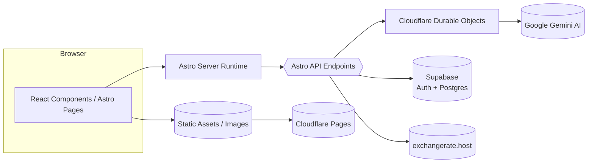

# TripCrafti

Advanced travel planning application combining precise manual management with AI-powered assistants. A comprehensive tool supporting travelers from initial inspiration through detailed planning, budgeting, and packing.

_Language:_ **English** | [Polski](./README.md)

## Table of Contents
- [About](#about)
- [Architecture](#architecture)
- [Installation](#installation)
- [Tech Stack](#tech-stack)
- [Environment Variables](#environment-variables)
- [Development](#development)
- [Deployment](#deployment)
- [Documentation](#documentation)
- [Contributing](#contributing)

## About

TripCrafti is designed to revolutionize travel planning by combining the precision of manual management with the power of AI-driven assistants.

### Key Modules

1. **Core Trip Planner (CRUD Core)**: Full CRUD control over:
   - Bookings (flights, hotels, cars)
   - Expenses (cost tracking and budget comparison)
   - Activities (manually added attractions or meetings)

2. **AI Itinerary Assistant**: Automated travel itinerary creation using external LLM integration that generates detailed, day-by-day schedules in JSON format. Uses **Cloudflare Durable Objects** for long-running AI generation (60-90 seconds) with persistent state and timeout management.

3. **AI Packing Assistant**: Generates personalized packing lists using trip data (destination, duration, planned activities) with item categorization and verification.

## Architecture

The application uses a hybrid architecture:
- **Frontend**: Astro 5 with React 19 components
- **Backend**: Astro Server Endpoints for business logic
- **Database**: Supabase (PostgreSQL with auth)
- **AI Processing**: Cloudflare Durable Objects for long-running generation
- **Deployment**: Cloudflare Pages + Workers



## Installation

### Prerequisites
- Node.js 18+ 
- npm or yarn
- Git

### Local Development Setup

1. **Clone and install dependencies**:
   ```bash
   git clone <repository-url>
   cd tripcrafti
   npm install
   ```

2. **Environment setup**:
   ```bash
   cp .env.example .env
   # Edit .env with your configuration
   ```

3. **Database setup**:
   - Create Supabase project
   - Run database migration: `db_schema.sql`
   - Configure auth policies

4. **Start development server**:
   ```bash
   # Local development (with Durable Objects fallback)
   npm run dev
   
   # Cloudflare development (real Durable Objects)
   npm run build
   npm run dev:cloudflare
   ```

### Cloudflare Deployment Setup

For production deployment with Durable Objects:

1. **Install Wrangler CLI**:
   ```bash
   npm install -g wrangler
   wrangler login
   ```

2. **Deploy Durable Objects Worker**:
   ```bash
   wrangler deploy --config wrangler-worker.toml
   ```

3. **Configure Secrets in Cloudflare KV**:
   ```bash
   wrangler kv:key put --namespace-id YOUR_KV_ID "GEMINI_API_KEY" "your-api-key"
   wrangler kv:key put --namespace-id YOUR_KV_ID "SUPABASE_SERVICE_ROLE_KEY" "your-service-key"
   ```

4. **Deploy Pages Application**:
   ```bash
   npm run build
   wrangler pages deploy dist
   ```

*Detailed deployment instructions: [docs/deployment.md](docs/deployment.md)*

## Tech Stack

### Core Framework
- **Astro 5**: Full-stack framework with SSR
- **TypeScript 5**: Type safety and developer experience
- **React 19**: Interactive components
- **Tailwind 4**: Utility-first CSS framework
- **Shadcn/ui**: Component library

### Backend & Infrastructure
- **Supabase**: Authentication and PostgreSQL database
- **Cloudflare Durable Objects**: Long-running AI generation
- **Cloudflare Pages**: Static site hosting with serverless functions
- **Cloudflare KV**: Secrets management

### External Integrations
- **Google Gemini AI**: Itinerary and packing list generation
- **exchangerate.host**: Real-time currency conversion

### Development Tools
- **Vitest**: Unit testing framework
- **ESLint**: Code linting
- **Prettier**: Code formatting

## Environment Variables

### Required for Development
```env
# Supabase Configuration
PUBLIC_SUPABASE_URL=your_supabase_url
PUBLIC_SUPABASE_ANON_KEY=your_supabase_anon_key
SUPABASE_SERVICE_ROLE_KEY=your_supabase_service_key

# AI Integration
GEMINI_API_KEY=your_gemini_api_key

# Development Configuration
NODE_ENV=development
```

### Cloudflare Production
In production, secrets are managed via Cloudflare KV:
- `GEMINI_API_KEY` → Cloudflare KV
- `SUPABASE_SERVICE_ROLE_KEY` → Cloudflare KV

### Optional
```env
# Geocoding (if needed)
GEOCODING_API_KEY=your_geocoding_key

# Development
DEBUG=true
```

## Development

### Available Scripts
```bash
npm run dev              # Local development with fallback
npm run dev:cloudflare   # Development with real Durable Objects
npm run build            # Production build
npm run preview          # Preview production build
npm run test             # Run tests
npm run lint             # Lint code
npm run format           # Format code
```

### Environment Types
| Environment | AI Generation | Configuration |
|-------------|---------------|---------------|
| Local (`npm run dev`) | Fallback to local | `.env` file |
| Cloudflare Dev (`npm run dev:cloudflare`) | Real Durable Objects | Build + wrangler dev |
| Production | Durable Objects | Cloudflare Pages + Worker |

### Development Guidelines

- Use Astro components (`.astro`) for static content
- Use React components only when interactivity is needed
- Extract logic into custom hooks in `src/components/hooks`
- Use services in `src/lib/services` for business logic
- Follow TypeScript strict mode guidelines

## Deployment

The application uses Cloudflare's hybrid architecture:

1. **Cloudflare Pages**: Hosts the main Astro application
2. **Cloudflare Workers**: Runs Durable Objects for AI generation
3. **Cloudflare KV**: Stores production secrets

### Deployment Checklist
- [ ] Database schema migrated
- [ ] Secrets configured in Cloudflare KV
- [ ] Durable Objects Worker deployed
- [ ] Pages application deployed
- [ ] Environment variables set

*Complete deployment guide: [docs/deployment.md](docs/deployment.md)*

## Documentation

- [Architecture](docs/architecture.md) - System design and flows
- [Deployment](docs/deployment.md) - Production deployment guide
- [Database Schema](docs/database-schema.md) - Database structure
- [Contributing](CONTRIBUTING.md) - Development guidelines

## Contributing

1. Fork the repository
2. Create feature branch: `git checkout -b feature/amazing-feature`
3. Commit changes: `git commit -m 'Add amazing feature'`
4. Push to branch: `git push origin feature/amazing-feature`
5. Open Pull Request

### Development Environment
- Follow the coding guidelines in [CONTRIBUTING.md](CONTRIBUTING.md)
- Run tests before submitting: `npm run test`
- Ensure code formatting: `npm run format`

## License

[MIT License](LICENSE) - see LICENSE file for details.

---

**Architecture Note**: This application uses Cloudflare Durable Objects for AI generation to handle long-running processes (60-90 seconds) with persistent state management and timeout handling. Local development includes automatic fallback when Durable Objects are unavailable.
