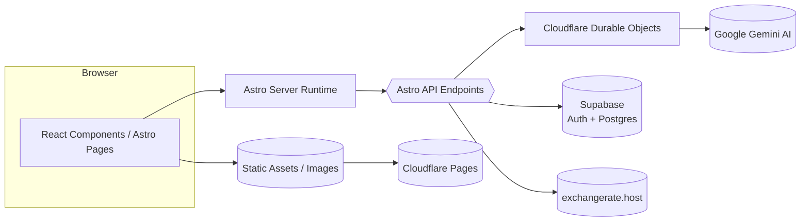
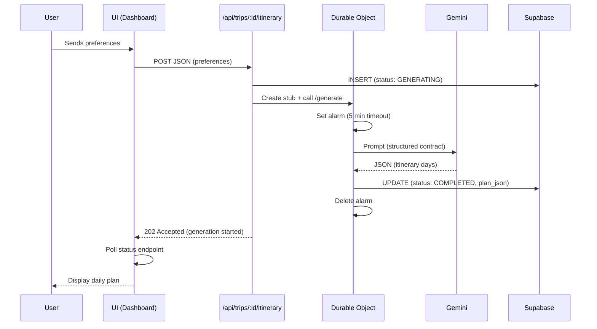
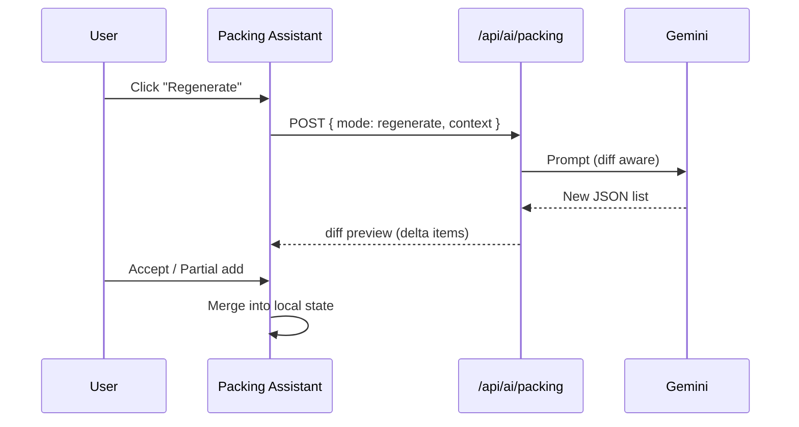
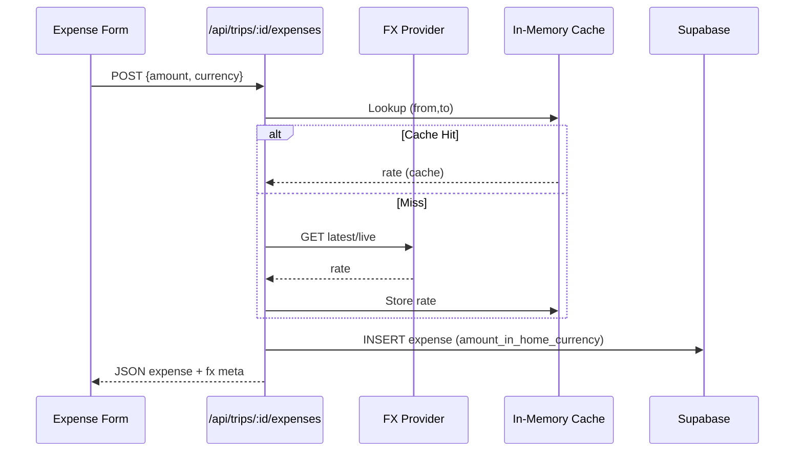
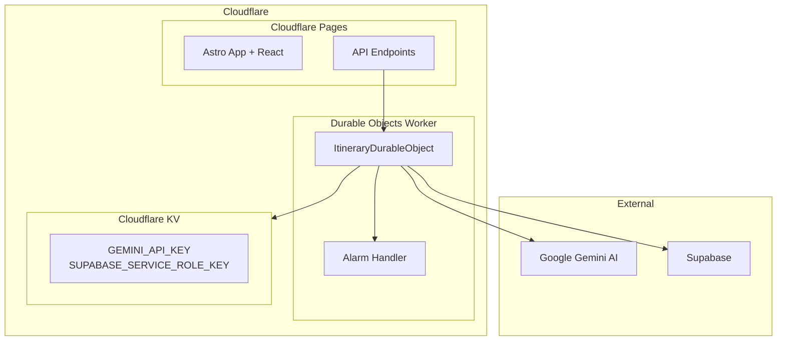

# TripCrafti Architecture

This document describes the high-level system architecture and main flows.

## 1. System Overview


## 2. Logical Layers
```mermaid
graph TD
  A[UI / Components] --> B[Hooks (state, side-effects)]
  B --> C[Services (lib/services)]
  C --> D[Integrations: Durable Objects / Gemini / FX / Supabase]
  D --> E[Storage: Supabase Tables + Cloudflare KV]
```
* **Components** – presentation, minimal logic.
* **Hooks** – state composition, fetch, transformations.
* **Services** – pure domain logic / external API adapters.
* **Integrations** – format and protocol translation.
* **Storage** – persistence (PostgreSQL, row-level security, Cloudflare KV for secrets).

## 3. Flow: Itinerary Generation (Durable Objects)


## 4. Flow: AI Packing (unchanged)


## 5. FX Conversion Lifecycle (unchanged)


## 6. Tables (updated)
| Table | Purpose | New Durable Objects columns |
|-------|---------|------------------------------|
| trips | Travel data | (unchanged) |
| expenses | Expenses | (unchanged) |
| budget_categories | Budget categories | (unchanged) |
| **generateditineraries** | Generated plans | **model_used, generation_duration_ms, input_tokens, thought_tokens, error_message** |
| packing_share_links | Sharing links | (unchanged) |

*(Full details in `docs/database-schema.md`)*

## 7. Cloudflare Deployment Architecture


## 8. Token Usage + Performance Tracking (AI)
* **Durable Objects** track: `model_used`, `generation_duration_ms`, `input_tokens`, `thought_tokens`
* **Timeout handling**: automatic alarm (5 min) + graceful cleanup
* **Model fallback**: gemini-2.5-flash → gemini-2.5-pro → other models
* **Development fallback**: local generation when Durable Objects unavailable

## 9. Error Handling Patterns (updated)
| Layer | Strategy |
|-------|----------|
| API | Early return with HTTP status + JSON { error } |
| Durable Objects | Alarm timeout + database cleanup + graceful column handling |
| FX | Fallback rate=1 + `warning` instead of throw |
| AI | Model fallback; if all fail → status FAILED |
| UI | Toast + preserve last valid state |

## 10. Development vs Production
| Environment | AI Generation | Configuration |
|-------------|---------------|---------------|
| Local (`npm run dev`) | Fallback to local | `.env` file |
| Cloudflare Dev (`npm run dev:cloudflare`) | Real Durable Objects | Build + wrangler dev |
| Production | Durable Objects | Cloudflare Pages + Worker |

## 11. Extensions (Future)
* Timeline / drag reorder itinerary
* Persist history of packing list versions
* Historical FX (date-based) + fx_rate per expense
* PWA offline caching core data
* **Durable Objects scaling**: handle more concurrent generations

---
**Update**: Document reflects new architecture with Cloudflare Durable Objects for long-running AI generation.
