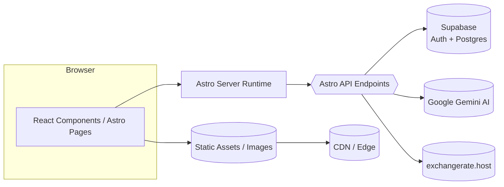
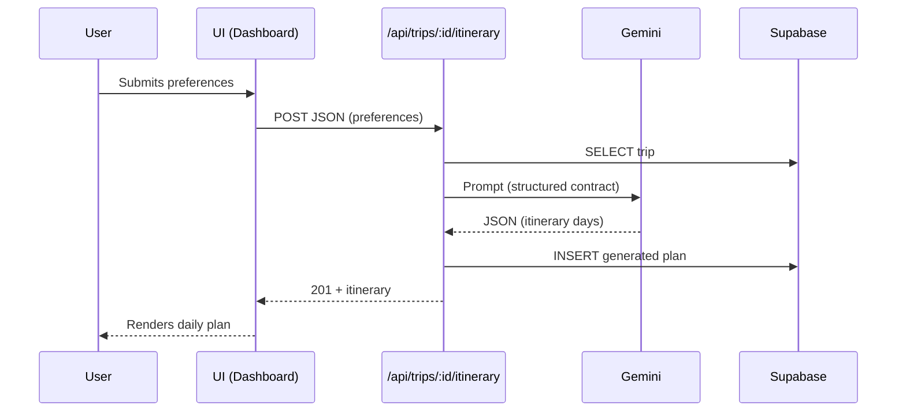
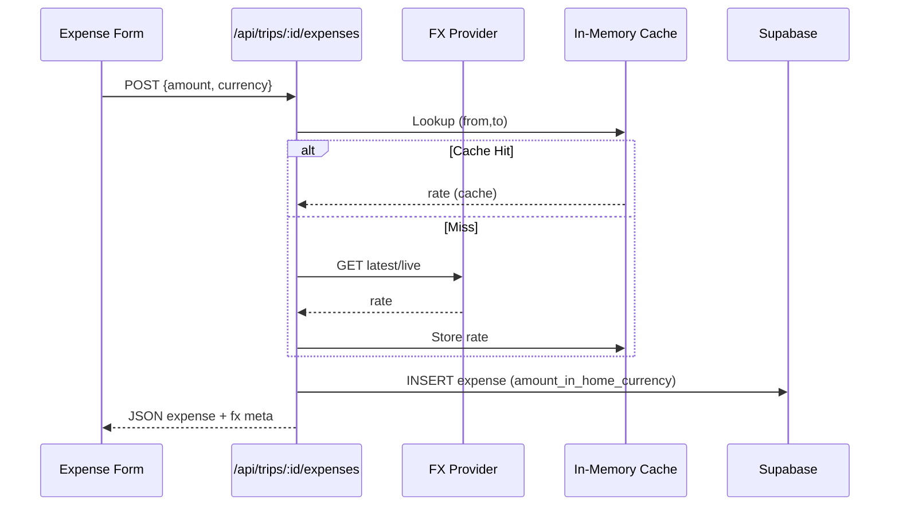

# TripCrafti Architecture

This document describes the high‑level system architecture and primary flows.

## 1. System View


## 2. Logical Layers
```mermaid
graph TD
  A[UI / Components] --> B[Hooks (state, side-effects)]
  B --> C[Services (lib/services)]
  C --> D[Integrations: Gemini / FX / Supabase]
  D --> E[Storage: Supabase Tables]
```
* **Components** – presentation, minimal logic.
* **Hooks** – state composition, fetching, transforms.
* **Services** – domain logic / API adapters.
* **Integrations** – protocol & data translation.
* **Storage** – persistence (PostgreSQL, row-level security).

## 3. Flow: Itinerary Generation


## 4. Flow: AI Packing (Regeneration)


## 5. FX Conversion Lifecycle


## 6. Tables (sample)
| Table | Purpose | Key Columns |
|-------|---------|-------------|
| trips | Trip data | id, user_id, title, destination, start_date, end_date, budget, currency |
| expenses | Expenses | id, trip_id, amount, currency, amount_in_home_currency, fx_rate, is_prepaid |
| budget_categories | Budget categories | id, trip_id, name, planned_amount, icon_name |
| itineraries | Generated itineraries | id, trip_id, preferences_json, generated_plan_json, status, token usage |
| packing_share_links | Packing share links | id, trip_id, token, can_modify, expires_at |

*(Additional columns exist – see `src/types.ts`)*

## 7. Token Usage (AI)
* Itinerary + packing track: `input_tokens`, `output_tokens`; thought tokens approximated if not explicit.
* Cost guard: packing regeneration limited (2x) for UX + budget protection.

## 8. Error Handling Patterns
| Layer | Strategy |
|-------|----------|
| API | Early return with HTTP status + JSON { error } |
| FX | Fallback rate=1 + `warning` instead of throwing |
| AI | Model fallback chain; if all fail → status FAILED |
| UI | Toast + preserve last good state |

## 9. Extensions (Future)
* Timeline / drag reorder itinerary
* Persist packing list version history
* Historical FX (date-based) + stored fx_rate per expense
* PWA offline caching of core data

---
**Maintenance**: Keep this aligned with README and `src/lib` comments.
