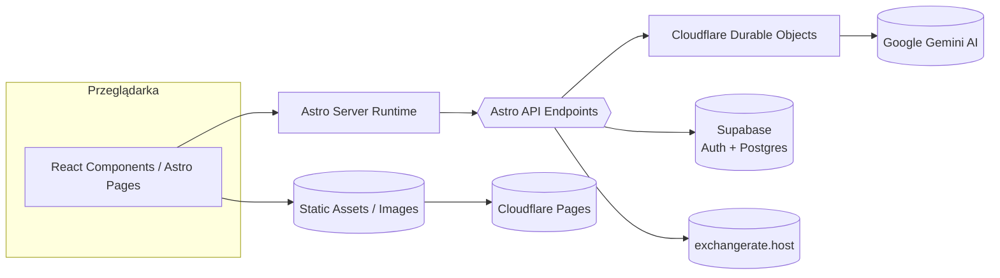
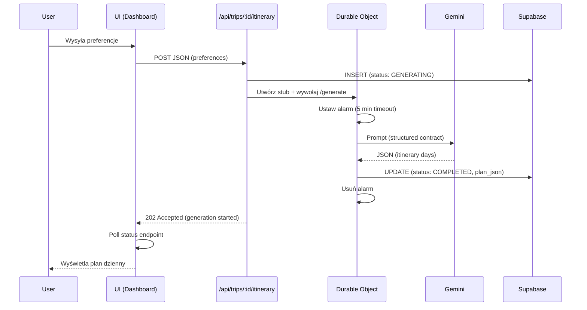
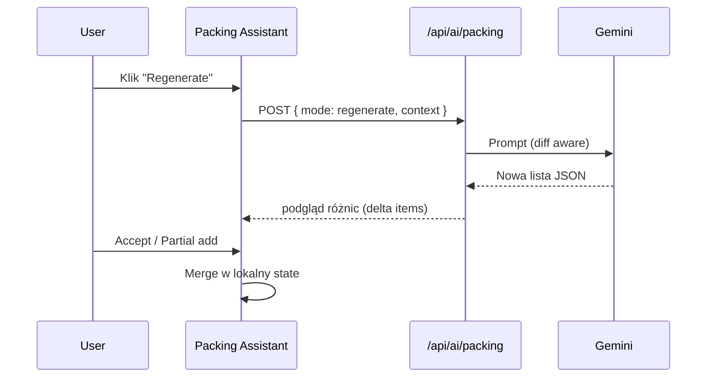
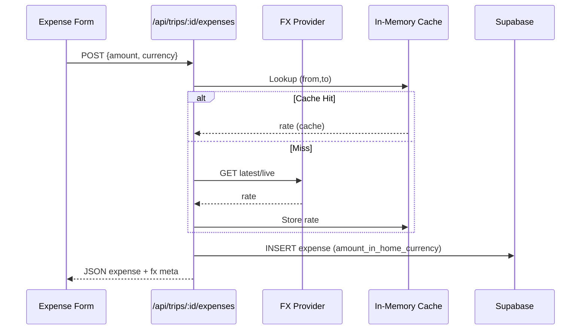
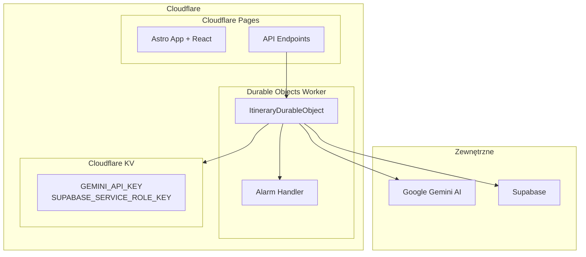

# Architektura TripCrafti

Dokument opisuje wysokopoziomową architekturę systemu oraz główne przepływy.

## 1. Widok Systemu


## 2. Warstwy Logiczne
```mermaid
graph TD
  A[UI / Components] --> B[Hooks (state, side-effects)]
  B --> C[Services (lib/services)]
  C --> D[Integracje: Durable Objects / Gemini / FX / Supabase]
  D --> E[Storage: Supabase Tables + Cloudflare KV]
```
* **Components** – prezentacja, minimalna logika.
* **Hooks** – kompozycja stanu, fetch, transformacje.
* **Services** – czysta logika domenowa / adaptery API zewnętrznych.
* **Integracje** – translacja formatów i protokołów.
* **Storage** – persystencja (PostgreSQL, row-level security, Cloudflare KV dla sekretów).

## 3. Przepływ: Generacja Itinerary (Durable Objects)


## 4. Przepływ: AI Packing (bez zmian)


## 5. FX Conversion Lifecycle (bez zmian)


## 6. Tabele (zaktualizowane)
| Tabela | Cel | Nowe kolumny Durable Objects |
|--------|-----|------------------------------|
| trips | Dane podróży | (bez zmian) |
| expenses | Wydatki | (bez zmian) |
| budget_categories | Kategorie budżetu | (bez zmian) |
| **generateditineraries** | Wygenerowane plany | **model_used, generation_duration_ms, input_tokens, thought_tokens, error_message** |
| packing_share_links | Linki współdzielenia | (bez zmian) |

*(Pełne szczegóły w `docs/database-schema.md`)*

## 7. Cloudflare Deployment Architecture


## 8. Token Usage + Performance Tracking (AI)
* **Durable Objects** śledzą: `model_used`, `generation_duration_ms`, `input_tokens`, `thought_tokens`
* **Timeout handling**: automatyczny alarm (5 min) + graceful cleanup
* **Model fallback**: gemini-2.5-flash → gemini-2.5-pro → inne modele
* **Development fallback**: lokalne generowanie gdy Durable Objects niedostępne

## 9. Error Handling Wzorce (zaktualizowane)
| Warstwa | Strategia |
|---------|-----------|
| API | Early return z HTTP status + JSON { error } |
| Durable Objects | Alarm timeout + database cleanup + graceful column handling |
| FX | Fallback rate=1 + `warning` zamiast throw |
| AI | Fallback modeli; jeśli wszystkie zawiodą → status FAILED |
| UI | Toast + zachowanie ostatniego poprawnego stanu |

## 10. Development vs Production
| Środowisko | AI Generowanie | Konfiguracja |
|------------|----------------|--------------|
| Local (`npm run dev`) | Fallback do lokalnego | `.env` file |
| Cloudflare Dev (`npm run dev:cloudflare`) | Prawdziwe Durable Objects | Build + wrangler dev |
| Production | Durable Objects | Cloudflare Pages + Worker |

## 11. Rozszerzenia (Future)
* Timeline / drag reorder itinerary
* Persist history of packing list versions
* Historical FX (date-based) + fx_rate per expense
* PWA offline caching core danych
* **Durable Objects scaling**: obsługa większej liczby równoczesnych generowań

---
**Aktualizacja**: Dokument odzwierciedla nową architekturę z Cloudflare Durable Objects dla długotrwałego AI generowania.
