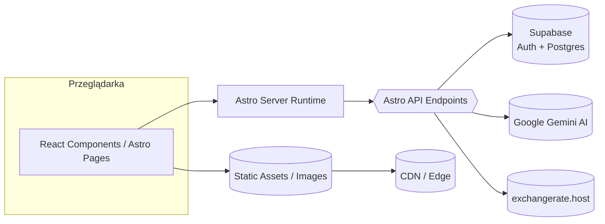
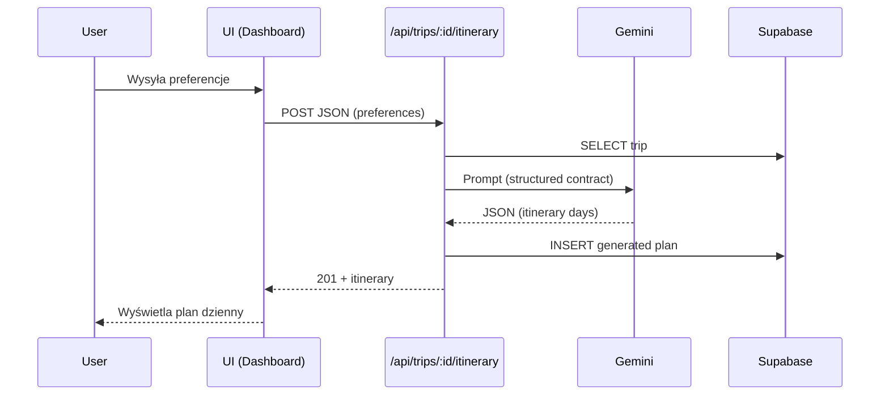
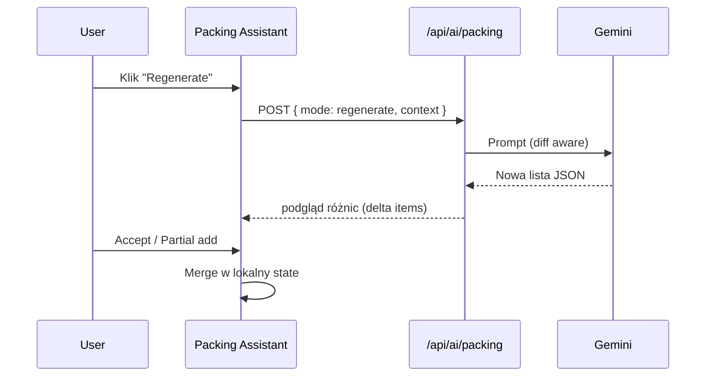
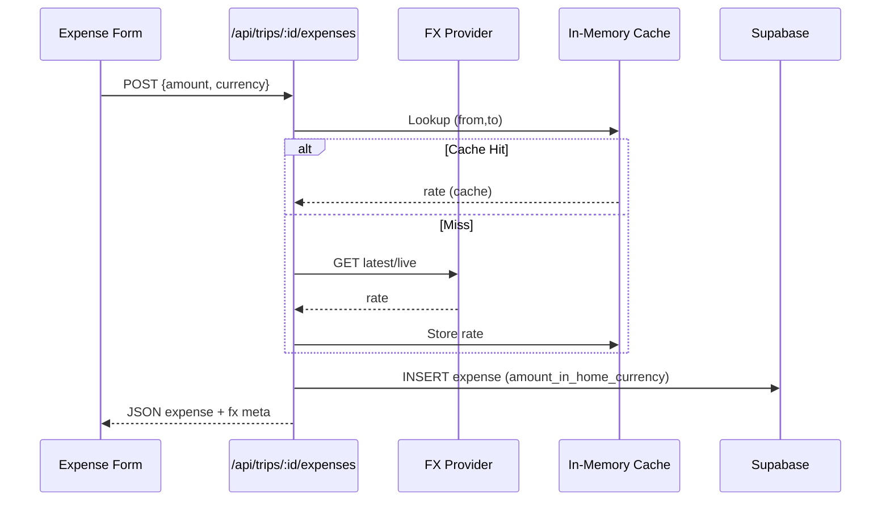

# Architektura TripCrafti

Dokument opisuje wysokopoziomową architekturę systemu oraz główne przepływy.

## 1. Widok Systemu


## 2. Warstwy Logiczne
```mermaid
graph TD
  A[UI / Components] --> B[Hooks (state, side-effects)]
  B --> C[Services (lib/services)]
  C --> D[Integracje: Gemini / FX / Supabase]
  D --> E[Storage: Supabase Tables]
```
* **Components** – prezentacja, minimalna logika.
* **Hooks** – kompozycja stanu, fetch, transformacje.
* **Services** – czysta logika domenowa / adaptery API zewnętrznych.
* **Integracje** – translacja formatów i protokołów.
* **Storage** – persystencja (PostgreSQL, row-level security).

## 3. Przepływ: Generacja Itinerary


## 4. Przepływ: AI Packing (Regeneracja)


## 5. FX Conversion Lifecycle


## 6. Tabele (przykładowe)
| Tabela | Cel | Kluczowe kolumny |
|--------|-----|------------------|
| trips | Dane podróży | id, user_id, title, destination, start_date, end_date, budget, currency |
| expenses | Wydatki | id, trip_id, amount, currency, amount_in_home_currency, fx_rate, is_prepaid |
| budget_categories | Kategorie budżetu | id, trip_id, name, planned_amount, icon_name |
| itineraries | Wygenerowane plany | id, trip_id, preferences_json, generated_plan_json, status, token usage |
| packing_share_links | Linki współdzielenia | id, trip_id, token, can_modify, expires_at |

*(Dodatkowe kolumny w kodzie – patrz `src/types.ts`)*

## 7. Token Usage (AI)
* Itinerary oraz packing śledzą: `input_tokens`, `output_tokens`; thought tokens estymowane (jeśli brak). 
* Limity kosztów: regeneracja packingu (2x) → UX + kontrola budżetu AI.

## 8. Error Handling Wzorce
| Warstwa | Strategia |
|---------|-----------|
| API | Early return z HTTP status + JSON { error } |
| FX | Fallback rate=1 + `warning` zamiast throw |
| AI | Fallback modeli; jeśli wszystkie zawiodą → status FAILED |
| UI | Toast + zachowanie ostatniego poprawnego stanu |

## 9. Rozszerzenia (Future)
* Timeline / drag reorder itinerary
* Persist history of packing list versions
* Historical FX (date-based) + fx_rate per expense
* PWA offline caching core danych

---
**Aktualizacja**: Dokument utrzymuj spójny z README oraz komentarzami w `src/lib`.
